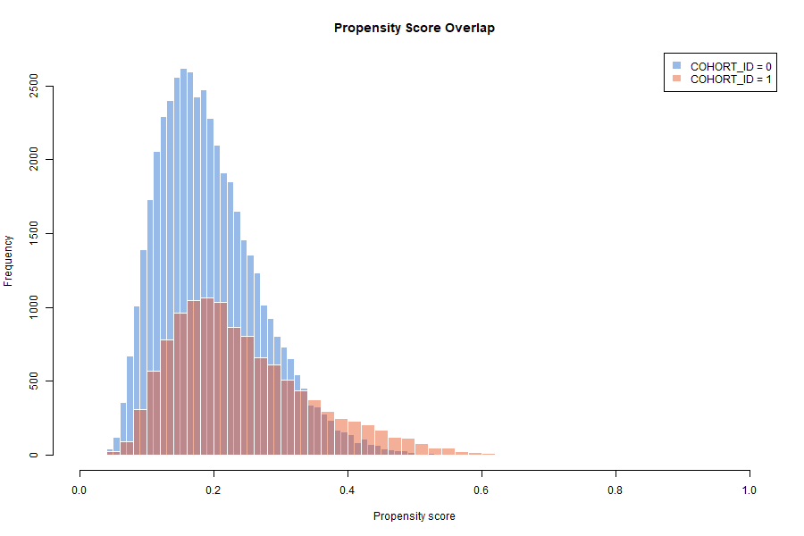
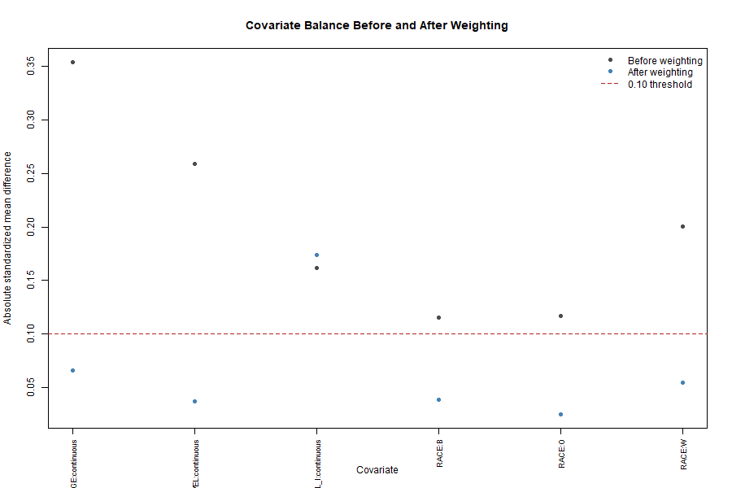

# Final Study Report

## Title

Comparative risk of adverse events among patients in target versus comparator cohorts in a de-identified observational analytic dataset

## Abstract

### Background

A de-identified person-level observational dataset was evaluated to estimate whether membership in a target cohort was associated with adverse event risk compared with a comparator cohort. Because the dataset contained baseline covariates and a binary outcome but no time-to-event information, the study was designed as a retrospective comparative cohort analysis of binary risk.

### Methods

The analysis included 57576 patients: 45845 in `COHORT_ID = 0` and 11731 in `COHORT_ID = 1`. The outcome was binary adverse event `AE`. Baseline covariates were age, race, pain level, and LDL. The pre-specified analyses included descriptive summaries, crude risks, multivariable logistic regression, inverse probability of treatment weighting using a propensity score model, covariate balance diagnostics, weight diagnostics, and exploratory subgroup summaries.

### Results

Crude adverse event risk was 10.72% in the target cohort and 6.79% in the comparator cohort. The adjusted odds ratio for target versus comparator cohort was 1.76 (95% CI 1.64 to 1.89). The propensity-score weighted risk difference was 0.046 (95% CI 0.040 to 0.052), and the weighted risk ratio was 1.69 (95% CI 1.58 to 1.78).

### Conclusions

The target cohort was consistently associated with higher adverse event risk than the comparator cohort across crude, outcome-regression, and propensity-score weighted analyses. The evidence should be interpreted as an adjusted observational association, not definitive causal evidence, because clinical definitions, timing, follow-up, and unmeasured confounding controls were limited.

## Background

Observational patient-level data can support reliable evidence generation when the research question, design, diagnostics, and interpretation are aligned with the information available in the data. This study followed an OHDSI-style journey from dataset intake to protocol-specified estimation and interpretation. The available dataset supported a comparative binary outcome question but did not support time-to-event, incidence-rate, dose-response, or longitudinal treatment-pattern questions.

The primary research question was whether `COHORT_ID = 1`, compared with `COHORT_ID = 0`, was associated with different adverse event risk after accounting for measured baseline differences in age, race, pain level, and LDL.

## Methods

### Data Source and Study Population

The source file was `analytic_dataset.csv`, a de-identified analytic dataset with one row per patient. Data quality checks confirmed required columns were present, required fields were complete, `PERSON_ID` was unique, and both `COHORT_ID` and `AE` were valid binary variables. No records were excluded by data quality checks.

### Study Design

The study was a retrospective, person-level, active-comparator cohort study. `COHORT_ID = 1` was treated as the target cohort and `COHORT_ID = 0` as the comparator cohort. `AE` was treated as the binary adverse event outcome measured during an assumed comparable outcome assessment window.

### Covariates

Measured baseline covariates were `AGE`, `RACE`, `PAIN_LEVEL`, and `LDL_I`. `PERSON_ID` was used only as an identifier for uniqueness checks. Because source documentation was unavailable, all baseline covariates were assumed to be measured before or at cohort entry.

### Statistical Analysis

Crude event risks were calculated by cohort. Logistic regression was used to estimate the adjusted odds ratio for `COHORT_ID = 1` versus `COHORT_ID = 0`, adjusting for age, race, pain level, and LDL. A propensity score model for cohort membership was fit using the same measured covariates, and inverse probability of treatment weights were used to estimate weighted risks, risk difference, and risk ratio. Bootstrap intervals with 200 replicates were used for weighted effect uncertainty. Diagnostics included standardized mean differences before and after weighting, propensity-score overlap, weight distributions, effective sample size, and exploratory subgroup summaries.

## Results

### Study Population and Baseline Characteristics

The final analysis population included 57576 patients. The target cohort was younger on average, had lower mean pain level, had higher mean LDL, and had a different race distribution than the comparator cohort.

**Table 1. Baseline Characteristics**

Characteristic | Comparator (`COHORT_ID = 0`) | Target (`COHORT_ID = 1`)
--- | ---: | ---:
Age, mean (SD) | 63.9 (SD 11.9) | 60.0 (SD 10.0)
Pain level, mean (SD) | 5.6 (SD 2.0) | 5.0 (SD 2.9)
LDL, mean (SD) | 112.5 (SD 41.1) | 121.9 (SD 70.8)
Race B | 9925 (21.6%) | 2004 (17.1%)
Race O | 16214 (35.4%) | 3508 (29.9%)
Race W | 19706 (43.0%) | 6219 (53.0%)

### Primary and Secondary Effect Estimates

Crude, adjusted, and weighted analyses all showed higher adverse event risk in the target cohort.

**Table 2. Main Effect Estimates**

Measure | Estimate
--- | ---:
Comparator adverse event risk | 3113/45845 (6.79%)
Target adverse event risk | 1257/11731 (10.72%)
Crude risk difference | 3.92%
Crude risk ratio | 1.58
Crude odds ratio | 1.65 (95% CI 1.54 to 1.76)
Adjusted odds ratio | 1.76 (95% CI 1.64 to 1.89)
Weighted risk difference | 0.046 (95% CI 0.040 to 0.052)
Weighted risk ratio | 1.69 (95% CI 1.58 to 1.78)

### Diagnostics

Covariate balance improved after weighting, with maximum absolute SMD decreasing from 0.354 to 0.174. The largest remaining imbalance was for LDL_I (continuous), with weighted absolute SMD 0.174. The overall propensity-score range was 0.038 to 0.680. The maximum IPTW was 25.05, and 3.58% of target-cohort records had weights greater than 10.

**Table 3. Covariate Balance Diagnostics**

Covariate | Level | Absolute SMD before weighting | Absolute SMD after weighting
--- | --- | ---: | ---:
AGE | continuous | 0.354 | 0.066
PAIN_LEVEL | continuous | 0.259 | 0.037
LDL_I | continuous | 0.161 | 0.174
RACE | B | 0.116 | 0.038
RACE | O | 0.117 | 0.025
RACE | W | 0.201 | 0.054

**Figure 1. Propensity Score Overlap**

**Figure 2. Covariate Balance Before and After Weighting**

### Exploratory Subgroup Results

The target cohort had higher crude adverse event risk than the comparator cohort in every summarized subgroup. These analyses were descriptive and were not designed as formal effect-modification tests.

**Table 4. Exploratory Subgroup Crude Risks**

Subgroup | Level | Comparator risk | Target risk
--- | --- | ---: | ---:
age_group | <50 | 312/5242 (6.0%) | 152/1722 (8.8%)
age_group | 50-64 | 1217/18499 (6.6%) | 650/6168 (10.5%)
age_group | 65-74 | 915/13418 (6.8%) | 359/2986 (12.0%)
age_group | 75+ | 669/8686 (7.7%) | 96/855 (11.2%)
RACE | B | 755/9925 (7.6%) | 267/2004 (13.3%)
RACE | O | 1108/16214 (6.8%) | 409/3508 (11.7%)
RACE | W | 1250/19706 (6.3%) | 581/6219 (9.3%)
pain_category | tertile_1 | 808/13856 (5.8%) | 492/5359 (9.2%)
pain_category | tertile_2 | 1108/16636 (6.7%) | 310/2539 (12.2%)
pain_category | tertile_3 | 1197/15353 (7.8%) | 455/3833 (11.9%)
ldl_category | <100 | 1113/17334 (6.4%) | 489/4799 (10.2%)
ldl_category | 100-129 | 878/12881 (6.8%) | 148/1451 (10.2%)
ldl_category | 130+ | 1122/15630 (7.2%) | 620/5481 (11.3%)

## Discussion

In this de-identified observational analytic dataset, target cohort membership was consistently associated with higher adverse event risk. The estimated absolute association was clinically interpretable: after propensity-score weighting, the target cohort had about 4.6 additional adverse events per 100 patients compared with the comparator cohort. The relative association was also consistent, with a weighted risk ratio of about 1.69 and an adjusted odds ratio of about 1.76.

The consistency across crude, regression-adjusted, and propensity-score weighted analyses supports the internal coherence of the finding. However, the diagnostics argue for caution. Propensity-score weighting improved measured covariate balance, but LDL remained imbalanced beyond the conventional 0.10 standardized mean difference threshold. Some target-cohort records also had large weights, indicating influence concentration and possible positivity stress. Most importantly, only four measured covariates were available, and the dataset did not include dates, follow-up time, source cohort definitions, outcome ascertainment details, prior history, medication dose, or care setting. These limitations mean that residual and unmeasured confounding remain plausible.

The appropriate interpretation is therefore that `COHORT_ID = 1` was associated with higher observed adverse event risk than `COHORT_ID = 0` in this analytic file. The study does not by itself establish that target cohort membership caused the higher risk.

## Limitations

- Cohort and outcome clinical definitions were not available in the file.
- No dates, follow-up time, or censoring information were available, so hazards and incidence rates could not be estimated.
- Only age, race, pain level, and LDL were available for confounding adjustment.
- LDL remained imbalanced after weighting, suggesting residual measured confounding.
- Some target-cohort records had high inverse probability weights, suggesting influence concentration.
- Subgroup summaries were descriptive and not formal interaction analyses.
- Generalizability cannot be judged because the source population and eligibility definitions were not provided.

## Conclusions

The study found a consistent adjusted observational association between target cohort membership and higher adverse event risk. The finding is suitable for internal decision support, hypothesis generation, and planning a more fully specified OHDSI network-style study, but it should not be disseminated as definitive causal evidence without additional source characterization, richer covariate capture, time-at-risk definitions, and empirical calibration or external validation.

## Associated Output Files

- Protocol: `step4_protocol_analysis_specification.md`
- Analysis script: `step5_execute_analysis.R`
- Results interpretation: `step6_results_interpretation.md`
- Baseline table: `results/table1_baseline_characteristics.csv`
- Crude outcomes: `results/table2_crude_outcomes.csv`
- Propensity diagnostics: `results/table3_ps_diagnostics.csv`
- Covariate balance: `results/table4_covariate_balance.csv`
- Adjusted model: `results/table5_adjusted_model.csv`
- Weighted effects: `results/table6_weighted_effects.csv`
- Subgroup summaries: `results/table7_subgroup_summaries.csv`
- Propensity overlap figure: `results/figure1_propensity_overlap.png`
- Balance figure: `results/figure2_covariate_balance.png`

## Step 7 Completion Check

- A final publication-style study report was written with background, methods, results, discussion, limitations, conclusions, tables, and figures.
- The report references the generated study tables and figures.
- Work product created: `step7_final_study_report.md`.
